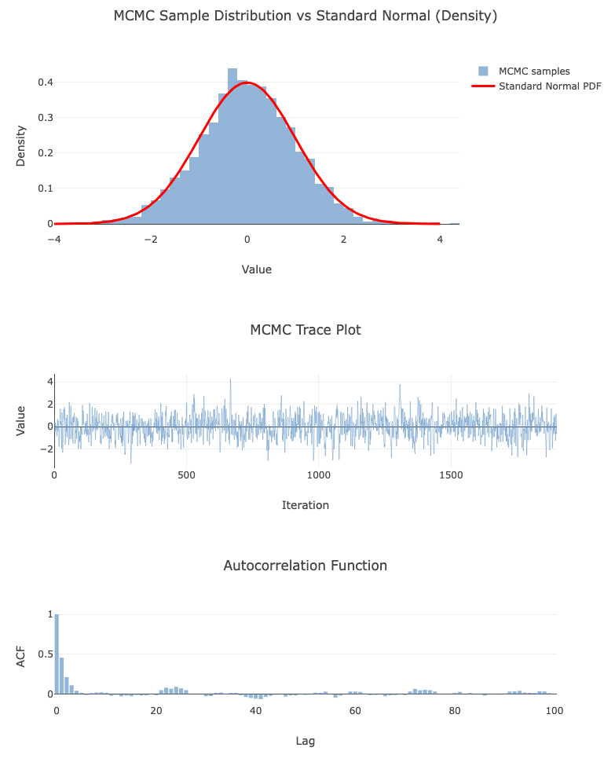

# 🧮 mcmc-ts

[](https://www.npmjs.com/package/mcmc-ts)
[](https://github.com/guilhermesfc/mcmc-ts/blob/main/LICENSE)
[](https://www.npmjs.com/package/mcmc-ts)

A lightweight **Markov Chain Monte Carlo** library in **TypeScript**, featuring a clean implementation of the **Metropolis–Hastings** algorithm.

---

## 🚀 What this is

`mcmc-ts` lets you sample from arbitrary probability distributions using Markov Chain Monte Carlo (MCMC) methods — starting with the **Metropolis–Hastings random walk sampler**.

It's written entirely in **TypeScript**, with zero dependencies, making it portable for both Node.js and browser environments.

---

## 📦 Installation

```bash
npm install mcmc-ts
```

---

## 🧑‍💻 Quick Example

Define a model and sample from it:

```typescript
import { defineModel } from "mcmc-ts";

// Define a model with a log-density
const model = defineModel({
  logDensity: (x) => -0.5 * x[0] * x[0], // N(0,1)
  dim: 1,
});

// Sample with multiple chains
const result = model.sample({
  iterations: 10_000,
  warmup: 1000,
  chains: 4,
  seed: 42n,
});

// Get summary statistics
const summary = result.summary();
console.log(summary);
// { mean: [0.01], sd: [1.02], ess: [3800], rhat: [1.001] }
```



---

## 🎯 Constrained Parameters

Use the `constraints` option for parameters with bounds:

```typescript
import { defineModel } from "mcmc-ts";

// Half-normal: N(0,1) restricted to positive values
const model = defineModel({
  logDensity: (x) => -0.5 * x[0] * x[0],
  dim: 1,
  constraints: { 0: "positive" },
});

const result = model.sample({
  iterations: 10_000,
  warmup: 1000,
});

// All samples are automatically positive
console.log(Math.min(...result.draws[0].map((d) => d[0]))); // > 0
```

**Available constraints:**

| Constraint                | Syntax                                     |
| ------------------------- | ------------------------------------------ |
| Positive (x > 0)          | `"positive"`                               |
| Unit interval (0 < x < 1) | `"unitInterval"`                           |
| Bounded                   | `{ type: "bounded", lower: 0, upper: 10 }` |
| Lower bounded             | `{ type: "lowerBounded", lower: 0 }`       |
| Upper bounded             | `{ type: "upperBounded", upper: 100 }`     |
| Simplex                   | `{ type: "simplex", k: 3 }`                |

**Example with multiple constraints:**

```typescript
const model = defineModel({
  logDensity: myLogDensity,
  dim: 3,
  constraints: {
    0: "positive", // x[0] > 0
    1: { type: "bounded", lower: 0, upper: 1 }, // 0 < x[1] < 1
    // x[2] unconstrained by default
  },
});
```

---

## 🎲 Sampling a Dirichlet Distribution

The simplex constraint handles the dimension change automatically:

```typescript
import { defineModel } from "mcmc-ts";

// Dirichlet(2, 3, 4) on a 3-simplex
const alpha = [2, 3, 4];

const model = defineModel({
  logDensity: (x) => {
    let logp = 0;
    for (let i = 0; i < x.length; i++) {
      logp += (alpha[i] - 1) * Math.log(x[i]);
    }
    return logp;
  },
  dim: 3,
  constraints: { 0: { type: "simplex", k: 3 } },
});

const result = model.sample({
  iterations: 10_000,
  warmup: 1000,
  chains: 4,
});

// Samples sum to 1 and are all positive
const sample = result.draws[0][0];
console.log(sample); // e.g., [0.22, 0.34, 0.44]
console.log(sample.reduce((a, b) => a + b)); // 1.0
```

---

## ⚙️ Sample Options

```typescript
const result = model.sample({
  // Required
  iterations: 10_000,

  // Chains & warmup
  chains: 4, // number of independent chains (default: 1)
  warmup: 1000, // warmup iterations to discard (default: 0)
  thin: 1, // keep every nth sample (default: 1)

  // Initialization
  seed: 42n, // RNG seed for reproducibility
  start: [0], // starting point (in constrained space)

  // Step size adaptation
  stepSize: 0.5, // proposal std dev (default: 0.5)
  targetAcceptance: 0.234, // target acceptance rate
  adaptSteps: 1000, // iterations to adapt step size

  // Return options
  includeWarmup: true, // return warmup draws
  includeUnconstrained: true, // return unconstrained space draws
});
```

---

## 📊 Result Object

```typescript
const result = model.sample({ iterations: 5000, warmup: 500, chains: 4 });

result.draws; // Vector[][] - post-warmup samples [chain][draw]
result.warmupDraws; // Vector[][] - warmup samples (if includeWarmup: true)
result.acceptanceRates; // number[] - acceptance rate per chain
result.rawTraces; // Vector[][] - complete traces

// Convenience method for diagnostics
result.summary(); // { mean, sd, ess, rhat }
```

---

## 🔧 Low-Level API

For more control, use `metropolisHastings` directly:

```typescript
import { metropolisHastings, positiveTransform } from "mcmc-ts";

const result = metropolisHastings(logDensity, 1, {
  iterations: 10_000,
  burnIn: 500,
  thin: 5,
  stepSize: 0.7,
  chains: 4,
  transforms: [{ startIndex: 0, transform: positiveTransform() }],
});

result.samples; // [chain][draw] - thinned, burned-in samples
result.acceptanceRates; // [chain]
result.rawTraces; // [chain][draw] - complete traces
```

---

## 📚 API Reference

**Model API (recommended)**

- `defineModel({ logDensity, dim, constraints? })` - Define a model
- `model.sample(options)` - Sample from the model

**Low-level API**

- `metropolisHastings(logDensity, dim, options)` - Direct sampler access

**Diagnostics**

- `summarizeChains(samples)` - Mean, sd, ESS, and R-hat
- `simpleESS(samples)`, `essBDA(samples)` - Effective sample size
- `rhat(chains)`, `rhatAll(samples)` - Gelman-Rubin convergence

**Transforms**

- `positiveTransform()`, `unitIntervalTransform()`, `simplexTransform(k)`
- `boundedTransform(lower, upper)`, `lowerBoundedTransform(lower)`, `upperBoundedTransform(upper)`
